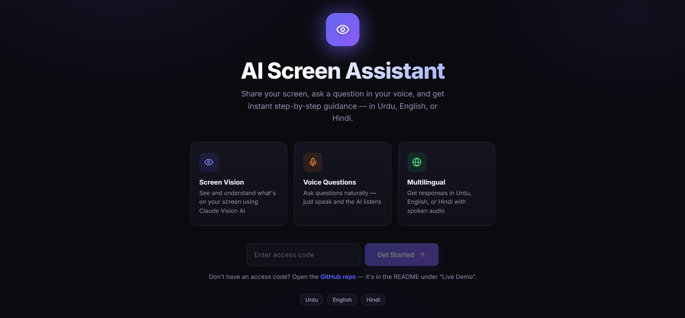
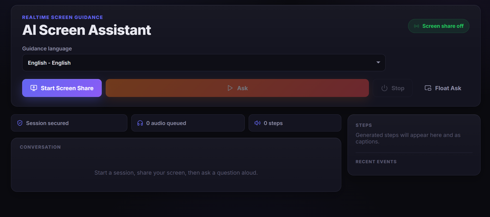
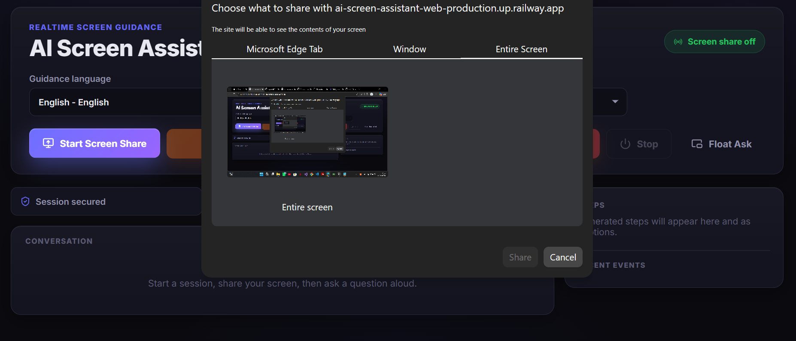
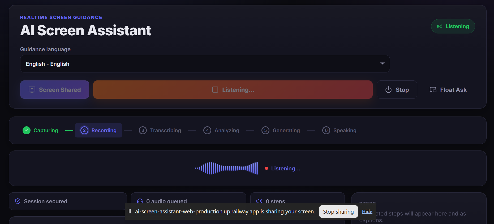
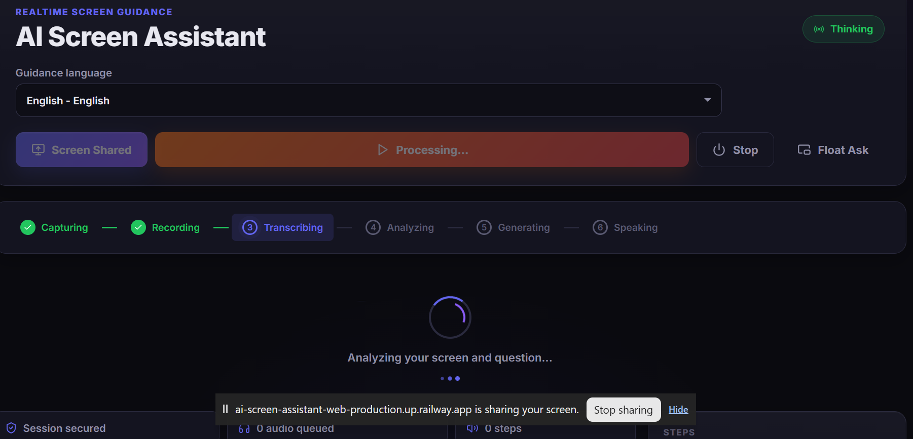

# AI Screen Assistant

An AI-powered real-time screen guidance app that helps people who struggle with technology navigate their devices using voice commands in Urdu, English, and Hindi.

---

## The Problem

Millions of people — elderly parents, first-time smartphone users, people with limited digital literacy — get stuck on simple tasks like sending a message, changing a setting, or opening an app. They can't follow written guides, and asking someone for help every time is frustrating and impractical. There is no tool that looks at their screen, understands what they see, and guides them step by step in their own language.

**AI Screen Assistant solves this.** It captures the user's screen, listens to their spoken question in Urdu, English, or Hindi, and delivers short, spoken, step-by-step guidance — like a patient tech-savvy friend sitting next to them.

---

## Live Demo

> **Live app:** https://ai-screen-assistant-web-production.up.railway.app/
>
> **Access code:** `z3sz9ldAFo7bIISQh29zIw`

**Try it in 30 seconds:**

1. Open the link above.
2. Enter the access code `z3sz9ldAFo7bIISQh29zIw` and click **Get Started**.
3. Click to **share your screen** (a browser prompt will appear).
4. Press the ask button and **speak a question** in Urdu, English, or Hindi — e.g. *"What is on my screen and what should I do next?"*
5. The assistant reads your screen and replies with short, spoken, step-by-step guidance plus on-screen captions.

The app also runs locally at `http://localhost:5173` after following the setup instructions below.

---

## Features

- **Real-time screen capture** — shares the user's screen directly in the browser using the WebRTC Screen Capture API
- **Voice questions in 3 languages** — speak in Urdu, English, or Hindi; the app transcribes and understands you
- **AI-powered screen analysis** — Claude Vision reads your screen and generates step-by-step guidance
- **Multilingual text-to-speech** — guidance is spoken aloud in your chosen language using gTTS or ElevenLabs
- **Live captions** — steps appear as on-screen overlays so you can read along
- **Chat history** — each exchange is displayed in a conversation thread for easy reference
- **Pipeline progress indicator** — visual feedback showing each stage: recording, transcription, AI analysis, TTS generation, playback
- **Audio waveform visualization** — real-time visual feedback while the microphone is recording
- **Floating ask button** — a draggable button that stays accessible while you navigate your screen
- **Session persistence** — authentication and session state survive page refreshes
- **Dark glass-morphism UI** — modern, accessible interface designed for readability
- **Docker-ready** — single command to run the full stack locally

---

## AI Feature

The core AI feature is **multimodal screen understanding with multilingual voice guidance**. When the user asks a question:

1. A screenshot of their current screen is captured
2. Their spoken question is transcribed using OpenAI Whisper
3. The screenshot + transcribed text are sent to **Claude Vision** (Anthropic) with a custom system prompt
4. Claude analyzes the screen and generates up to 3 simple, actionable steps
5. Each step is converted to speech in the user's language and played back

### System Prompt

```
You are a kind, patient, and clear tech assistant helping a user navigate
their device. You are shown a screenshot of what the user currently sees.

The user's preferred language is: {LANGUAGE}

RULES:
- Respond ONLY in {LANGUAGE}. Do not switch to English unless {LANGUAGE} is English.
- Give a maximum of 3 steps. Do not overwhelm.
- Keep each step to one short sentence, ending with a period.
- Reference visible UI elements by their exact on-screen label or colour/position.
- Use simple, non-technical language a grandparent would understand.
- If you cannot identify the screen, say so and ask the user to describe what they see.
- Never mention AI, models, APIs, or any technical internals.
- Never use markdown formatting, bold (**), bullet points, or special characters.
  Respond in plain text only.
- Never say you cannot help. Always attempt guidance or ask a clarifying question.
```

This prompt was designed to produce guidance that is short, plain-text (no markdown for clean TTS), non-technical, and respectful — suitable for users with zero tech background.

---

## Tools, Services, and AI Models

| Layer | Tool | Purpose |
|-------|------|---------|
| **AI Model** | Claude Vision (Anthropic) | Multimodal screen understanding and step generation |
| **Speech-to-Text** | OpenAI Whisper (local, `small` model) | Transcribes spoken questions in Urdu/English/Hindi |
| **Text-to-Speech** | gTTS (Google) / ElevenLabs (fallback) | Speaks guidance steps in the user's language |
| **Translation** | Google Translator (via `deep-translator`) | Safety-net translation if Claude responds in the wrong language |
| **Backend** | Python 3.12, FastAPI, Socket.IO | Real-time WebSocket server, JWT auth, pipeline orchestration |
| **Frontend** | React 18, TypeScript, Vite 8 | SPA with screen capture, audio recording, real-time streaming |
| **Containerization** | Docker, Docker Compose | One-command local deployment |

---

## Screenshots

Screenshots of the app in action (images live in `docs/screenshots/`).

### 1. Welcome screen — enter the access code


### 2. Workspace — pick a language and start a session


### 3. Screen sharing — choose what to share


### 4. Listening — recording the spoken question


### 5. Analyzing — transcribing and understanding the screen


---

## How to Run

### Prerequisites

- Docker and Docker Compose installed
- An Anthropic API key (for Claude Vision)

### Steps

1. **Clone the repository**

```bash
git clone https://github.com/<your-username>/ai-screen-assistant.git
cd ai-screen-assistant
```

2. **Create the environment file**

```bash
cp .env.example .env
```

3. **Add your API key to `.env`**

```text
ANTHROPIC_API_KEY=your-anthropic-api-key-here
PRE_SHARED_SECRET=your-access-code-here
JWT_SECRET=any-random-string
```

4. **Start the app**

```bash
docker compose up --build
```

5. **Open in your browser**

Navigate to `http://localhost:5173`, enter your access code, share your screen, and ask a question.

### Local Development (without Docker)

**Backend:**

```bash
cd backend
pip install -r requirements.txt
uvicorn main:app --reload --port 8000
```

**Frontend:**

```bash
cd web
npm install
npm run dev
```

---

## Security

- Screen frames and audio are processed transiently — nothing is stored on the server
- Authentication uses short-lived JWTs issued after access-code exchange
- API keys are kept in environment variables and never committed to the repository
- CORS is restricted to configured origins

---

## License

This project was built as a final project for **ACT AI**.
